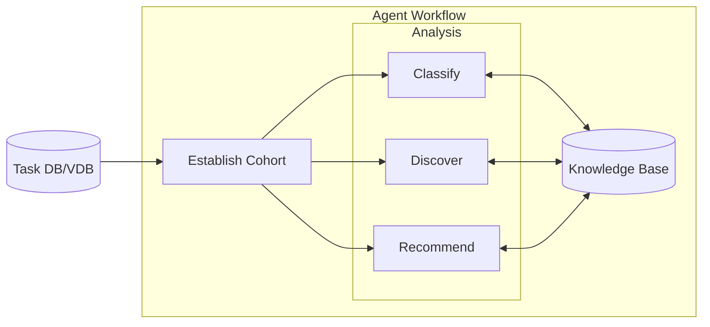
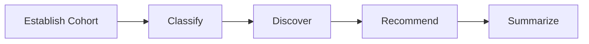
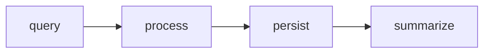
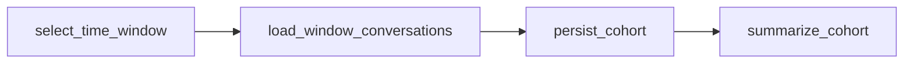
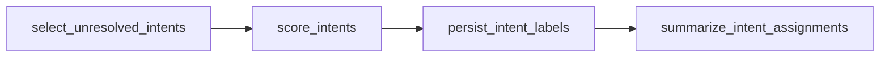
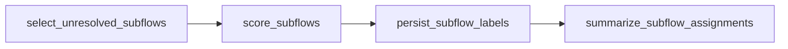
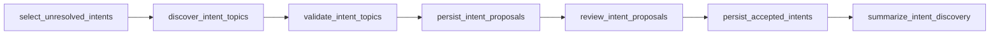
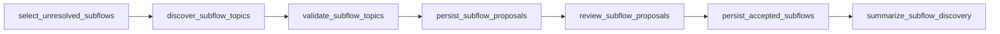
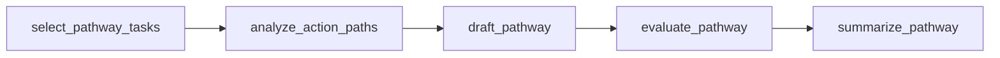

# fresh-skills (topic + agent integration worktree)

LangGraph playbook-maintenance agent with BERTopic discovery used as callable
capabilities. Neither subsystem was redesigned.

```text
weekly batch
     ↓
DS discover_intent_topics / discover_subflow_topics / discover_action_paths
     ↓
adapters → MetaAgentState
     ↓
load_playbook / retrieve_guidance
     ↓
existing classify → discover → recommend → HITL flow
```

* **Agent owns** orchestration, graph state, KB/playbook loading, RAG, tools, HITL, persistence.
* **DS owns** intent/topic discovery, subflow discovery, and action-path discovery.
* `src/playbook/adapters.py` is the only boundary. BERTopic objects do not enter graph state.

## Setup

```text
uv sync
```

Copy `.env` if you want LangSmith traces (`LANGSMITH_API_KEY`, `LANGSMITH_PROJECT`).

## Demo app

`streamlit_app.py` is the front end for the deep agent: one threaded chat over
`create_playbook_agent`, streaming tokens and tool events as they arrive.

```text
uv sync
uv run streamlit run streamlit_app.py
```

Needs `OPENAI_API_KEY` in `.env`; `.env` overrides an inherited environment.
Tasks and KB resolve separately, each from the first directory that holds them
among `$FRESH_SKILLS_DATA_DIR`, `scratch_data/eda/` (the notebook fill output),
and `scratch_data/` (the small repo seed) — so a fill folder with tasks but no
KB of its own still runs. The sidebar reports what resolved. The app builds a
disposable SQLite working store beside the tasks — one file per generation, since
`TaskStore` opens a connection per thread and Windows will not let a live handle
be unlinked.

The first message of each thread carries a one-line context prefix naming the
store's task count and date span, so a bare "Aug 25" resolves to the seeded year
instead of the model's guess.

**Stop** interrupts the current turn and keeps whatever streamed. **New agent**
rebuilds the runtime from seed and discards the agent with its checkpointer,
dropping every thread along with discovered intents, subflows, and persisted
pathways.

## Customer Intent, Subflow and Workflow Discovery

### Top-level agent workflow

**What**: The agent operates on top of an existing customer support agent. It
processes a multitude of help desk tasks, aggregating them to classify customer
intent, the subflows within those intents, and successful agent workflows.

**Who**: Internal help desk agent managers. It does not interact with customers
directly.

**Why**: The customer complaint agent needs to identify new customer intentions,
subflows, and turn pathways to stay fresh. Normally, memory only automatically
improves using single traces, which can miss overall trends and cause
regressions. This agent uses machine learning topic classification and discovery
techniques to provide fresh guidance based on analysis of aggregate task traces.

**How**: The meta agent isolates task trace data in subgraphs, accessed by
tools, which then pass summarized data to the parent agent. The objective is to
let the meta agent see the big picture while preventing state from being overrun
by individual task data.



The cohort is established from agent requests for particular date ranges,
intents, and/or subflows with missing labels. Rather than passing actual traces,
**pointers** to the cohort are passed to subsequent nodes. This also keeps the
aggregates clean if new tasks are loaded mid-run.

### Deep agent structure: model with tool calls in a loop

This provides agent decision making with user interaction.

I had originally planned a strict workflow that reflects a deterministic ML
approach:



However, it did not allow for as much flexibility around dates, observability,
and choices around discovering new intents before classifying.

The chosen agent structure looks like this:


The agent has a limited number of tools which call statistical workflows, a tool
to retrieve data from the knowledge base (`retrieve_guidance`), and a separate
persistence tool for writing recommended pathways to the knowledge base.

| tool | role |
| --- | --- |
| `cohort` | select the working set of tasks |
| `classify_intent` | assign existing intents |
| `classify_subflow` | assign existing subflows |
| `discover_intent` | propose a new intent |
| `discover_subflow` | propose a new subflow |
| `recommend_pathway` | draft a pathway from successful traces |
| `persist_recc` | commit an approved draft to the KB |
| `retrieve_guidance` | read the live KB |

There are interrupts baked into any writebacks to the knowledge base, but they
are set to be authorized automatically for this demo.

Each turn of the main and sub-graphs is sent to LangSmith, but the main agent
state does not see sub-agent state.

### Subgraphs as tools — shared execution pattern

Every subgraph follows the same structural loop. Task objects live inside the
subgraph only. The agent calls tools that

1. query multiple tasks
2. process tasks using statistical operations
3. persist the results
4. summarize results for the agent

The subgraph nodes are labelled with the subgraph name and phase:



I decided to create a shared structure for the tools so that when following the
traces there is a shared concept base. I find it gets confusing trying to follow
tools that name each step in their own way. The metadata simplifies this by
labelling the family that each step belongs to.

In addition, the steps can be isolated within LangSmith for specific analysis.
They can also be fairly easily found and changed in the code base if a specific
phase needs to be universally changed. The phase labels also made it simpler to
tune the returned tool summaries: at first they were too sparse — overprotecting
the agent state memory — and left the agent ignorant of proposed changes and
details.

The agent does not directly call or process tasks unless it is specifically
asked to assess examples. It can call `cohort` and ask for task samples, or get
details from the knowledge base.

After a KB mutation, the next classifier **re-queries the store**. It does not
reuse an in-memory leftover list of unresolved tasks.

### Tool descriptions and subgraph flows

Node names below are the real graph nodes; their position is the phase — query,
process, persist, summarize.

#### `cohort`

Retrieve a cohort of tasks, or peek at a few. A persist call replaces the
working set and returns a `run_id`; `sample_n` or `task_ids` is a peek that does
neither.



#### `classify_intent`

Assign existing intents to unlabeled cohort tasks.



#### `classify_subflow`

Assign existing subflows to tasks that already have an intent. Matches the
customer's issue to an issue type under that intent.



#### `discover_intent`

Look for a possible new intent among unresolved tasks. Discovery is evidence for
a candidate, not proof one should be created — so proposals are persisted, then
reviewed, before anything is accepted.



#### `discover_subflow`

Look for a possible new issue type among unresolved tasks in an intent. A new
subflow can be added without a pathway.



#### `recommend_pathway`

Draft a pathway recommendation from successful task traces. Drafts only — it
does not write the knowledge base.



#### `retrieve_guidance`

Read the live knowledge base. An empty query returns the intent and subflow
catalog; query text ranks existing intents by cosine on stored embeddings;
`include_guidance` adds guideline text. No subgraph.

#### `persist_recc`

Commit an approved pathway draft to the store and knowledge base. Call only
after `recommend_pathway` and review. A missing draft returns an error instead
of writing. Unsupported drafts are stored but not attached to the live knowledge
base. No subgraph.

### Future improvements

* Wire in true interrupts, allowing direct editing of recommended new knowledge
  base entries.
* Pydantic shapes and validation for knowledge base entries.
* Re-classification of task intent and subflows using the updated knowledge base.
* Comparison of existing guidelines (workflow pathways) against new guidelines
  with more data. Call customer-facing agent evals against the updated knowledge
  base before committal, to avoid regression.
* Direct agent evaluation of new KB entries based on task cohort samples.
* Performance evals: how well classification, discovery, and pathways compare to
  gold standards. Current evals are built around agent execution, not
  statistical performance.

## Primary workflow

```python
from playbook import build_graph, configure_runtime, retrieve_guidance

playbook, store = configure_runtime(method="jaccard")
agent = build_graph()
result = agent.invoke(
    {
        "run_id": "week-2026-09-01",
        "start": "2026-09-01",
        "end": "2026-09-07",
        "method": "jaccard",
        "kb_version": playbook.version,
    }
)
```

Canonical runtime KB is still `scratch_data/seed_*.json` via `load_playbook` /
`retrieve_guidance`. DS `data/raw/kb.json` is not a runtime source.

## Integration notebook

`notebooks/integrate_topic_agent.ipynb` imports `src/playbook`, fills Agent KB
files by hand, then calls `agent.invoke` with an explicit `start`/`end` window.
`invoke_week` remains a thin test wrapper.

## Tests

```text
uv run pytest
```
