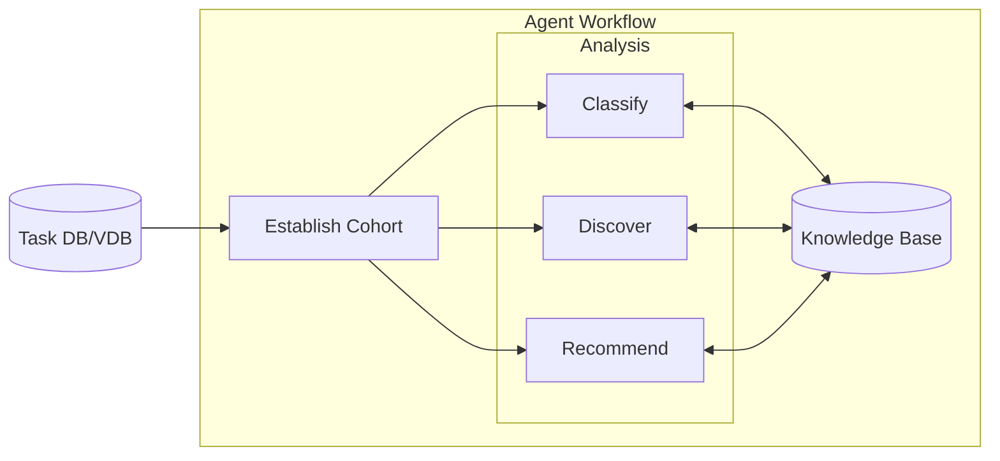
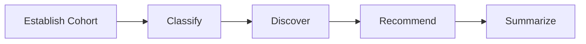
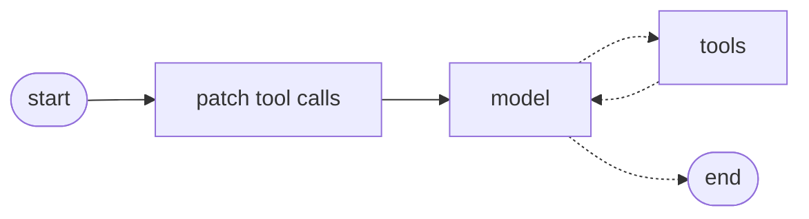
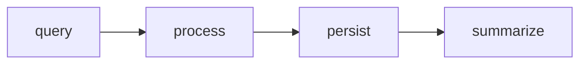
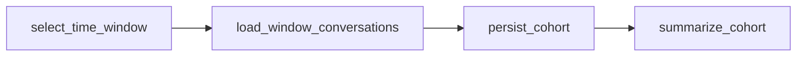
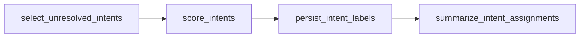
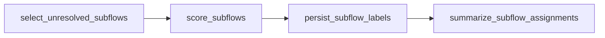
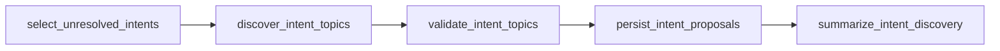
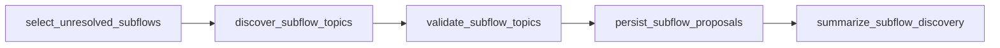
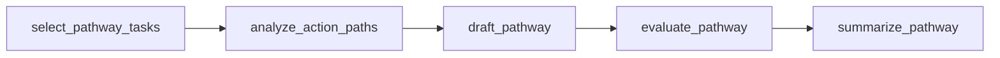

# fresh-skills

A LangGraph deep agent that keeps a customer-support knowledge base current. It
classifies support tasks against the existing intent taxonomy, uses BERTopic to
find intents and subflows the taxonomy is missing, and drafts response pathways
from traces that succeeded.

The two halves stay separate on purpose:

* **The agent** owns orchestration, graph state, KB loading, retrieval, tools, review gating, and persistence.
* **The topic models** own intent discovery, subflow discovery, and action-path discovery.
* `src/playbook/adapters.py` is the only boundary between them. BERTopic objects never enter graph state.

## Setup

```text
uv sync
uv run streamlit run streamlit_app.py
```

Python 3.11+. `uv.lock` is a universal lock, so the same command works on
macOS, Linux and Windows.

Copy `.env.example` to `.env` and set `OPENAI_API_KEY`. `LANGSMITH_API_KEY` and
`LANGSMITH_PROJECT` are optional and turn on tracing.

The first start downloads the `all-MiniLM-L6-v2` sentence-transformer (~90 MB)
and embeds the 145 demo tasks. That takes a minute or two and only happens once
— the embeddings are cached in a local DuckDB file beside the data.

## Demo app

`streamlit_app.py` is the front end for the deep agent: one threaded chat over
`create_playbook_agent`, streaming tokens and tool events as they arrive.

```text
uv run streamlit run streamlit_app.py
```

Needs `OPENAI_API_KEY` in `.env`; `.env` overrides an inherited environment.
Tasks and knowledge base both load from `demo_data/`, or from
`$FRESH_SKILLS_DATA_DIR` if that is set. The sidebar reports what resolved. The
app builds a disposable SQLite working store beside the data — one file per
generation, since `TaskStore` opens a connection per thread and Windows will not
let a live handle be unlinked.

The first message of each thread carries a one-line context prefix naming the
store's task count and date span, so a bare "Aug 25" resolves to the seeded year
instead of the model's guess.

The **New agent** popover carries a `bertopic` / `jaccard` scoring toggle,
applied when you reset — no app restart. `jaccard` skips the BERTopic fit in
classification and discovery, which is faster and coarser. Startup cost is the
same either way: embeddings are synced for KB retrieval regardless, and cached
in DuckDB after the first run. The sidebar shows the active method.

**Stop** interrupts the current turn and keeps whatever streamed. **New agent**
rebuilds the runtime from seed and discards the agent with its checkpointer,
dropping every thread along with discovered intents, subflows, and persisted
pathways.

## Customer Intent, Subflow and Workflow Discovery

### Top-level agent workflow

**What**: The agent operates on top of an existing customer support agent. It
processes a multitude of help desk tasks, aggregating them to classify customer
intent, the subflows within those intents, and successful agent workflows.

**Who**: Internal help desk agent managers. It does not interact with customers
directly.

**Why**: The customer complaint agent needs to identify new customer intentions,
subflows, and turn pathways to stay fresh. Normally, memory only automatically
improves using single traces, which can miss overall trends and cause
regressions. This agent uses machine learning topic classification and discovery
techniques to provide fresh guidance based on analysis of aggregate task traces.

**How**: The meta agent isolates task trace data in subgraphs, accessed by
tools, which then pass summarized data to the parent agent. The objective is to
let the meta agent see the big picture while preventing state from being overrun
by individual task data.



The cohort is established from agent requests for particular date ranges,
intents, and/or subflows with missing labels. Rather than passing actual traces,
**pointers** to the cohort are passed to subsequent nodes. This also keeps the
aggregates clean if new tasks are loaded mid-run.

### Deep agent structure: model with tool calls in a loop

This provides agent decision making with user interaction.

I had originally planned a strict workflow that reflects a deterministic ML
approach:



However, it did not allow for as much flexibility around dates, observability,
and choices around discovering new intents before classifying.

The chosen agent structure looks like this:



The agent has a limited number of tools which call statistical workflows, a tool
to retrieve data from the knowledge base (`retrieve_guidance`), and a separate
persistence tool for writing recommended pathways to the knowledge base.

| tool | role |
| --- | --- |
| `cohort` | select the working set of tasks |
| `classify_intent` | assign existing intents |
| `classify_subflow` | assign existing subflows |
| `discover_intent` | propose a new intent |
| `discover_subflow` | propose a new subflow |
| `recommend_pathway` | draft a pathway from successful traces |
| `persist_recc` | commit an approved draft to the KB |
| `retrieve_guidance` | read the live KB |

Knowledge-base writes are gated by a two-call protocol rather than a LangGraph
interrupt: `discover_intent`, `discover_subflow` and `recommend_pathway` draft
into the store, and a second call — carrying names, or `persist_recc` — is what
commits. The agent has to come back and ask for the write, and the user sees the
draft in between.

Each turn of the main and sub-graphs is sent to LangSmith, but the main agent
state does not see sub-agent state.

### Subgraphs as tools — shared execution pattern

Every subgraph follows the same structural loop. Task objects live inside the
subgraph only. The agent calls tools that

1. query multiple tasks
2. process tasks using statistical operations
3. persist the results
4. summarize results for the agent

The subgraph nodes are labelled with the subgraph name and phase:



I decided to create a shared structure for the tools so that when following the
traces there is a shared concept base. I find it gets confusing trying to follow
tools that name each step in their own way. The metadata simplifies this by
labelling the family that each step belongs to.

In addition, the steps can be isolated within LangSmith for specific analysis.
They can also be fairly easily found and changed in the code base if a specific
phase needs to be universally changed. The phase labels also made it simpler to
tune the returned tool summaries: at first they were too sparse — overprotecting
the agent state memory — and left the agent ignorant of proposed changes and
details.

The agent does not directly call or process tasks unless it is specifically
asked to assess examples. It can call `cohort` and ask for task samples, or get
details from the knowledge base.

After a KB mutation, the next classifier **re-queries the store**. It does not
reuse an in-memory leftover list of unresolved tasks.

### Tool descriptions and subgraph flows

Node names below are the real graph nodes; their position is the phase — query,
process, persist, summarize.

#### `cohort`

Retrieve a cohort of tasks, or peek at a few. A persist call replaces the
working set and returns a `run_id`; `sample_n` or `task_ids` is a peek that does
neither.



#### `classify_intent`

Assign existing intents to unlabeled cohort tasks.



#### `classify_subflow`

Assign existing subflows to tasks that already have an intent. Matches the
customer's issue to an issue type under that intent.



#### `discover_intent`

Look for a possible new intent among unresolved tasks. Discovery is evidence for
a candidate, not proof one should be created, so the tool takes two calls. The
first clusters and persists proposals and writes nothing to the knowledge base:



The second call carries `names` — the agent's chosen ids for the proposals it
wants kept. It runs no subgraph: the named proposals are marked accepted, the
knowledge base is updated, and the same summary is returned. A proposal nobody
names is never inserted, and that split is the review step.

#### `discover_subflow`

Look for a possible new issue type among unresolved tasks in an intent. Same
two-call shape as `discover_intent`. A new subflow can be added without a
pathway.



#### `recommend_pathway`

Draft a pathway recommendation from successful task traces. Drafts only — it
does not write the knowledge base.



#### `retrieve_guidance`

Read the live knowledge base. An empty query returns the intent and subflow
catalog; query text ranks existing intents by cosine on stored embeddings;
`include_guidance` adds guideline text. No subgraph.

#### `persist_recc`

Commit an approved pathway draft to the store and knowledge base. Call only
after `recommend_pathway` and review. A missing draft returns an error instead
of writing. Unsupported drafts are stored but not attached to the live knowledge
base. No subgraph.

## Repo layout

```text
streamlit_app.py     the demo front end: one threaded chat over the deep agent
src/playbook/
  agent.py           the eight tools and `create_playbook_agent`
  graph.py           the compiled subgraphs each tool invokes
  adapters.py        the only boundary between the agent and the topic models
  topics.py          BERTopic discovery and prototype classification
  scoring.py         jaccard fallback scoring
  actions.py         action-path and common-workflow discovery
  kb.py              PlaybookKB, loading and retrieval
  store.py           SQLite working store (tasks, cohorts, proposals, drafts)
  vectors.py         DuckDB embedding cache
  runtime.py         the process-local playbook + store binding
demo_data/           145 seeded tasks and the seed knowledge base
evals/               the LangSmith dataset, its uploader and its runner
tests/               unit tests, plus live tests behind a marker
```

## Calling the agent directly

The tools are the public surface. Everything the Streamlit app does is
available from Python:

```python
from playbook import configure_runtime, create_playbook_agent

playbook, store = configure_runtime(method="jaccard")
agent = create_playbook_agent()
result = agent.invoke(
    {"messages": [{"role": "user", "content": "Classify the 2026-09-01 to 2026-09-07 cohort."}]},
    config={"configurable": {"thread_id": "demo"}},
)
print(result["messages"][-1].content)
```

Individual tools can be invoked without a model, which is how the tests drive
them:

```python
from playbook import classify_intent, cohort

cohort.invoke({"start_date": "2026-09-01", "end_date": "2026-09-07", "run_id": "demo"})
classify_intent.invoke({})
```

`cohort` comes first: it fixes the working set every later tool reads.

## Demo data

`demo_data/` holds 145 support conversations spanning 2026-08-25 to 2026-09-14,
derived from the [ABCD](https://github.com/asappresearch/abcd) dataset, plus the
seed ontology, knowledge base and guidelines. Dates are synthetic and staged so
the demo has something to find:

| window | what is in it |
| --- | --- |
| Aug 25 – Sep 8 | seed traffic, classifiable against the seed KB |
| Sep 9 – 10 | noise |
| Sep 10 – 12 | `status_payment_method`, a subflow the KB does not have |
| Sep 12 – 14 | `slow_speed`, an intent the KB does not have |

The scripts that pull ABCD down and build this folder live on the development
branch; this branch carries the built result so the demo runs from a clone.

## Evals

`evals/responsiveness.json` is the dataset: user requests, the tools each one
should reach for, and the tools it must not. `evals/agent_target.py` holds the
target and the grading, shared so the LangSmith run and the local tests cannot
drift apart.

```text
uv run python evals/upload_dataset.py   # once, creates the LangSmith dataset
uv run python evals/run_eval.py         # scores the agent against it
```

Three graders: every expected tool ran, no forbidden tool ran, and the dates in
the request reached the `cohort` call. Each example runs against a fresh working
store, so a knowledge-base write in one row cannot change the next.

These evals measure agent responsiveness — did it do what was asked — not
statistical quality of the classifications themselves.

## Tests

```text
uv run pytest            # unit and integration, no network, no API key
uv run pytest -m live    # the real agent against the real model
```

The default run stubs the embedding model and the topic fit, so it is
deterministic and offline. `tests/test_eval_harness.py` drives the real tool
loop with a scripted model, which covers everything about the eval path except
the model's own choices.

The live tests need `OPENAI_API_KEY`. They run the requests from
`evals/responsiveness.json` against the 145-task store and then check the store
itself — that classification wrote labels, that discovery persisted proposals
without touching the KB, and that a pathway only reaches the KB after it is
approved.

## Future improvements

* Wire in true LangGraph interrupts, allowing direct editing of recommended
  knowledge base entries.
* Pydantic shapes and validation for knowledge base entries.
* Re-classification of task intent and subflows using the updated knowledge base.
* Comparison of existing guidelines (workflow pathways) against new guidelines
  with more data. Call customer-facing agent evals against the updated knowledge
  base before committal, to avoid regression.
* Direct agent evaluation of new KB entries based on task cohort samples.
* Performance evals: how well classification, discovery, and pathways compare to
  gold standards. Current evals are built around agent execution, not
  statistical performance.
