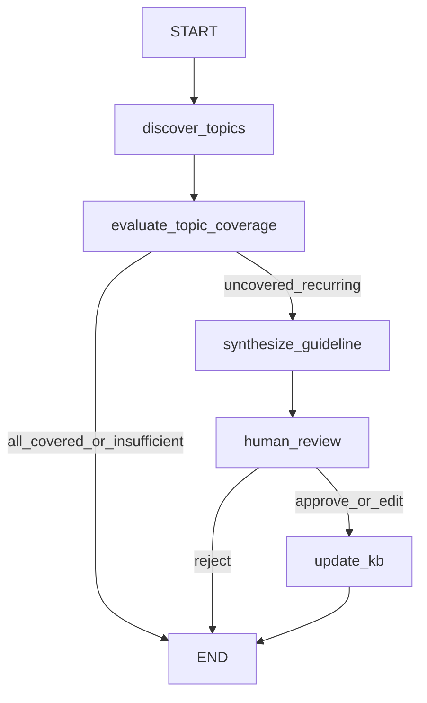
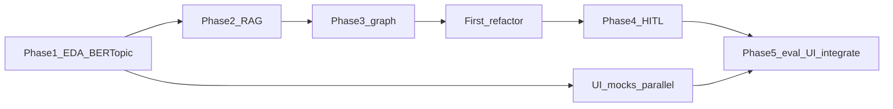

# Playbook Maintenance Agent — Implementation Plan

This step only writes planning documents. After you approve, create:

- [docs/PLAN.md](docs/PLAN.md)
- [docs/phases/phase_01.md](docs/phases/phase_01.md) through [docs/phases/phase_05.md](docs/phases/phase_05.md)

Do not implement the agent, download ABCD, or create notebooks/tests until those docs are reviewed.

## What changed from the prior plan

The previous plan treated ABCD subflow labels as the runtime recurring categories (analyze batch by known A/B/C/D, then retrieve/decide). That is no longer the architecture.

**Now:**

- ABCD `flow` / `subflow` are **offline only**: subset selection, fixture construction, BERTopic sanity checks, evaluation truth.
- Runtime receives weekly conversations **without** held-out subflow identity.
- **BERTopic** is the default off-the-shelf runtime topic-discovery component. No custom clustering unless Phase 1 EDA shows BERTopic cannot produce a usable result on the narrow subset.
- Matching to the live KB is **semantic retrieval + agent coverage judgment**, not topic-ID or subflow-ID equality. BERTopic IDs are not stable across weeks and are not the definition of "new workflow."
- An uncovered topic leads to **guideline synthesis** from runtime evidence. Human approval persists **that generated/edited text**, never the withheld ABCD canonical guideline.
- Duplicate prevention across weeks is "retrieve current KB and judge coverage," not cross-week cluster tracking.
- Tests must not assert `BERTopic topic N == subflow C`. Fixture determinism stays in unit tests; topic quality lives in notebooks and a small eval.

Unchanged: three-week controlled experiment, five TDD phases, phase notebooks as merge gates, parallel UI worktree, small LangGraph, one LangChain tool, LangSmith tracing/eval, DuckDB/Parquet, no Week 4 required.

## What is already true

- Authoritative take-home: [Agent Engineer Take Home Exercise.md](c:\Users\doste\projects\Focused_exercise\Agent Engineer Take Home Exercise.md) (lives **outside** this git repo).
- Planning instruction for this repo: [docs/plan_prompt.md](docs/plan_prompt.md). It **supersedes** the older parent [buildplan-1.md](c:\Users\doste\projects\Focused_exercise\buildplan-1.md).
- Repo is empty of application code. [pyproject.toml](pyproject.toml) has Jupyter/Jupytext only. No `README.md`, `src/`, or `tests/`.
- Worktree notebook rule already exists: [`.cursor/rules/worktree-notebooks.mdc`](.cursor/rules/worktree-notebooks.mdc).

**Scope cuts vs the older buildplan:** three demo weeks (no required Week 4 revision); five phases (eval folds into Phase 5 with UI); `docs/` not `plans/`; TDD + a phase notebook as each merge gate; parallel UI worktree against frozen mocks.

## Product

A weekly **playbook maintenance** agent, not a support chatbot. It reviews a small batch of completed support conversations, **discovers recurring structure from content**, and asks whether the live operational KB adequately covers those discovered topics. If not, it synthesizes a guideline from representative evidence. A human must approve/edit/reject before the JSON KB mutates. Approved knowledge is RAG corpus for later weeks.

```text
weekly conversation batch (no subflow labels)
        ↓
BERTopic topic discovery
        ↓
discovered topic candidates
+ representative conversations
+ topic descriptors
        ↓
semantic retrieval against CURRENT operational KB
        ↓
agent coverage judgment (not a similarity cutoff)
        ↓
uncovered + enough evidence → synthesize guideline
        ↓
human review
        ↓
persist the approved generated/edited guideline
        ↓
later weeks retrieve against the updated KB
```

Three distinct concepts (do not collapse them):

```text
ABCD subflow identity     = hidden experiment / evaluation label
ABCD canonical guideline  = held-out target / reference truth
agent-proposed guideline  = runtime-generated candidate KB addition
```

## Intentionally limited scope

**In:** one ABCD top-level flow; at most four subflows; three deterministic weekly fixtures; off-the-shelf BERTopic on that subset; tiny JSON KB + in-memory LangChain retriever; one LangGraph graph; one `@tool`; native `interrupt()` HITL; LangSmith tracing + a small eval (decision + optional semantic guideline quality); thin Streamlit UI that shows topic evidence.

**Out:** custom clustering/topic-model research; elaborate cross-week cluster identity; topic-model microservices; a BERTopic analytics dashboard; Week 4 revision; Jira; Docker; PII redaction; streaming; extra vector infra; service/repository layers; sampling the full ABCD intent space.

Use BERTopic because topic discovery is solved enough to consume. The engineering story remains playbook maintenance, not topic modeling.

**EDA shortlist (not a locked choice — Phase 1 notebook must decide, including BERTopic usability):**

- `account_access` — 3 subflows (`recover_username`, `recover_password`, `reset_2fa`), distinct action sequences, readable guidelines.
- `shipping_issue` — exactly 4 subflows (`status`, `manage`, `missing`, `cost`).
- `product_defect` — 6 subflows; only if EDA justifies picking four.

Avoid FAQ-like `storewide_query` / `single_item_query` unless EDA **and** BERTopic output show they are the only clean option.

Do not require perfect clustering. Accept merges, splits, and noise if the downstream demo remains understandable.

## Target architecture

Package name: `playbook` under `src/playbook/`. LLM: `ChatOpenAI` via `langchain-openai` (`OPENAI_API_KEY`). Prefer functions + Pydantic over classes.

```text
ABCD raw JSON
  → scripts/prepare_demo.py
  → Parquet in data/demo/  (runtime columns omit flow/subflow)
  → hidden labels in data/reference/ or a non-runtime table
  → DuckDB SQL
  → small Pydantic records / IDs
  → BERTopic (runtime)
  → LangGraph
```

Canonical live KB is human-readable JSON. Retrieval is a tiny LangChain `InMemoryVectorStore` rebuilt from that JSON (no FAISS/Chroma). Held-out ABCD `guidelines.json` excerpts live in `data/reference/` and must never be indexed or passed into BERTopic.

**Responsibility split:**

- **Deterministic / libraries:** load week, BERTopic fit/transform, embeddings, retrieval, persistence, schema validation, fixture construction.
- **LLM / agent:** topic coherence, coverage vs retrieved guidance, novel vs clustering artifact, guideline synthesis from evidence, abstain vs propose.
- **Do not** ask the LLM to cluster. **Do not** treat a fixed similarity threshold as "new workflow" unless Phase 1 EDA strongly justifies it. Similarity retrieves candidates; the agent judges operational coverage.

**Smallest honest graph** (boxes are conceptual; collapse if a node would be bookkeeping):



- `discover_topics`: load the week's conversations **without** subflow labels; run BERTopic; emit topic descriptors + representative conversation IDs. Topic IDs are local to this run.
- `evaluate_topic_coverage`: for each meaningful topic, retrieve nearest **current** live KB entries from topic text / representative evidence; optionally `inspect_conversation`; structured coverage judgment `covered | uncovered | insufficient`.
- `synthesize_guideline`: only for an uncovered candidate with enough evidence; grounded in representatives, observed actions, descriptors, nearest KB. Never reads held-out guidelines.
- `human_review`: native `interrupt()`; resume with `Command(resume=...)`.
- `update_kb`: persist the **approved generated or edited** guideline text; rebuild retriever.
- Checkpointer: SQLite (`langgraph-checkpoint-sqlite`), thread IDs `demo-week-1` / `demo-week-2` / `demo-week-3`.

Week 2 anti-duplicate: rerun BERTopic on Week 2 text (IDs will differ). Coverage against the **updated** KB should mark the previously approved workflow as covered. No separate cluster-alignment subsystem unless the simplest retrieve-and-judge path demonstrably cannot work.

Do not pass DataFrames through graph state. Do not pass held-out subflow labels into graph state.

## Data experiment (offline A/B/C/D)

Phase 1 EDA chooses one flow and labels four subflows A–D **for fixture construction only**. Runtime never sees those labels as answers.

- **Week 1:** conversations whose hidden labels are a limited mix (A, B, recurring C). Seed KB covers A and B only. BERTopic should surface more than one useful topic. Downstream should find at least one inadequately covered candidate and synthesize a proposal (expected **operational** outcome: add guidance for the C-like pattern).
- **Week 2:** introduce hidden subflow D; include behavior corresponding to C. If Week 1 was approved, live KB contains the **generated** C-like guideline. System should treat that pattern as covered and propose for the newly uncovered D-like pattern — even if BERTopic partitions differ from Week 1.
- **Week 3:** only underlying workflows that should now be in the live KB. BERTopic still runs. Meaningful topics should be covered. Expected decision: `no_action`.

C must appear more than once in Week 1 so recurrence is visible in content, not just in labels. Fixtures are pinned conversation IDs, not random samples.

ABCD facts to cite in PLAN.md:

- Conversations: `convo_id`, `scenario.flow`, `scenario.subflow`, `original` turns, `delexed` with `targets[2]` = action name.
- `ontology.json`: 10 flows / 55 subflows.
- `kb.json`: subflow → action-button list (compact).
- `guidelines.json`: rich NL procedures (**eval truth, not runtime RAG or BERTopic input**).

## Shared contracts (freeze early)

Own in `src/playbook/schemas.py`. Freeze after Phase 1 merge so the UI worktree can mock them. Changing field names after freeze requires a coordinated merge.

Runtime-facing (no ABCD subflow identity):

```python
WeeklyBatch           # week_id, conversation_ids
ConversationRecord    # conversation_id, turns, actions
                      # NO flow/subflow at runtime
DiscoveredTopic       # run-local topic_id, size, descriptor,
                      # representative_conversation_ids
TopicCoverage         # topic_id, retrieved_kb, judgment
                      # covered | uncovered | insufficient, rationale
KBEntry               # id, title, guideline
                      # no required ABCD subflow field
ReviewProposal        # action="add", label, synthesized guideline,
                      # evidence_summary, representative_conversation_ids,
                      # nearest_kb_ids, rationale
RunResult             # week_id, thread_id, decision,
                      # discovered_topics, coverage_judgments,
                      # proposal, findings, interrupted
ReviewDecision        # status="approve"|"edit_approve"|"reject",
                      # edited_guideline?
```

Offline/eval only (never imported by BERTopic, retriever, or decide/synthesize prompts):

```python
FixtureLabel          # conversation_id, flow, subflow
HeldOutGuideline      # hidden_subflow, canonical_abcd_text
```

UI must not reimplement topic discovery, retrieval, or coverage. Graph must not import Streamlit.

**First integration point:** Phase 1 merge (fixtures + schemas, including `DiscoveredTopic` / `RunResult` shapes). **Second:** Phase 5 (swap UI mocks for `invoke_week(week_id) -> RunResult` / resume helpers).

## Worktree strategy



- **Backend stream (serial):** Phase 1 → 2 → 3 → first refactor → 4.
- **UI stream (parallel after Phase 1 merge):** Streamlit against mock `RunResult` that includes discovered topics + coverage + proposal. No graph/BERTopic imports until Phase 5.
- Each phase worktree owns `notebooks/phase_0X_*.ipynb` (Jupytext pair). Do **not** edit a shared `demo_story.ipynb` from a feature worktree; that notebook is a Phase 5 / post-merge artifact.

## Refactor points

1. **After Phase 3 GREEN** — first real refactor: smaller functions, clearer node boundaries, typed state, strip duplicate transforms, keep BERTopic vs retrieval vs LLM split. Not a new architecture. Not a topic-tracking framework.
2. **After Phase 5 integration** — small readability pass: delete mock-boundary leftovers, align notebook/UI/graph on one invoke helper.

No refactor in Phases 1–2 (`NO REFACTOR`).

## Target tree (created across later phases, not now)

```text
src/playbook/{config,schemas,data,topics,kb,tools,graph,evals}.py
app.py
kb/{seed_guidelines,current_guidelines}.json
data/{raw,demo,reference}/
scripts/{download_abcd,prepare_demo,reset_demo}.py
notebooks/phase_01_data_eda.ipynb … phase_05_eval_ui.ipynb
tests/
.env.example
```

`topics.py` is a thin BERTopic wrapper (fit on this week's documents, return `DiscoveredTopic` records). It is not a research package.

---

## Phase 1 — ABCD EDA + BERTopic feasibility + fixtures

**Why:** The demo is invalid if subflows are silently chosen **or** if BERTopic cannot produce understandable recurring candidates on that subset. Fixtures and schemas unlock every later worktree.

**Owns:** `scripts/download_abcd.py`, `scripts/prepare_demo.py`, `src/playbook/{data,schemas,config}.py`, a thin experimental BERTopic call in the notebook (package `bertopic` as a Phase 1 dependency), `data/demo/*.parquet`, hidden labels under `data/reference/` or equivalent, `tests/test_demo_fixtures.py`, `notebooks/phase_01_data_eda.ipynb`. Add `duckdb`, `pydantic`, `pytest`, `python-dotenv`, `bertopic`. Full README is Phase 5.

**RED tests (fixtures and leakage, not topic IDs):** `test_only_one_top_level_flow`, `test_no_more_than_four_demo_subflows`, `test_week2_introduces_exactly_one_new_subflow`, `test_week3_introduces_no_new_subflow`, `test_demo_fixture_is_deterministic`, `test_runtime_batch_omits_subflow_labels`.

Do **not** unit-test `topic_id == subflow`. Topic quality is a notebook + later eval concern.

**GREEN:** Reproducible Parquet + `load_week(week_id) -> WeeklyBatch` of unlabeled `ConversationRecord`s. DuckDB is the query path. Hidden labels exist for eval/fixture assertions only. A/B/C/D assignment is the **output** of the notebook, gated on BERTopic looking usable.

**Notebook (real EDA — show failures, not only the winner):**

- candidate flows/subflows, counts, action patterns, excerpts, rejected subsets;
- BERTopic on promising controlled subsets: topic count/size, descriptors, representatives;
- comparison to held-out subflow labels (merges/splits/noise);
- settings that materially affected the result (document the choice; do not over-optimize);
- why the final one-flow / up-to-four-subflow experiment was selected;
- week membership tables (offline labels).

If several reasonable BERTopic settings work, pick one, document it, move on. Custom clustering only if BERTopic is unusable on this narrow set.

**LangSmith:** `.env.example` with `LANGSMITH_API_KEY` / `LANGSMITH_PROJECT` / `LANGSMITH_TRACING=true`. Optional smoke `Client()` ping. No eval dataset yet.

**Refactor:** `NO REFACTOR`. **Merge when:** tests pass, fixtures exist, notebook executed, human agrees with the chosen subset **and** that BERTopic output is demo-usable.

## Phase 2 — Operational KB + semantic matching / RAG

**Depends on:** Phase 1 merge. **No graph.** BERTopic may be used in the notebook as a query source; the product of this phase is retrieval, not discovery.

**Owns:** `kb/seed_guidelines.json`, `kb/current_guidelines.json`, `data/reference/` (held-out C/D **canonical** guidelines), `src/playbook/kb.py`, `tests/test_kb_rag.py`, `notebooks/phase_02_kb_rag.ipynb`. Add `langchain`, `langchain-openai`, `langchain-core`.

Seed KB is **rewritten short operational prose** for A and B only — not a dump of `guidelines.json`, and not keyed as "you must retrieve by subflow name."

**RED:** `test_seed_kb_contains_known_workflows`, `test_seed_kb_excludes_held_out_workflows`, `test_covered_evidence_retrieves_existing_guidance`, `test_reference_truth_is_not_runtime_retrievable`, `test_adding_generated_guideline_changes_retrieval`.

Queries in tests should look like topic descriptors or representative conversation/action text, not `subflow="recover_password"`.

**GREEN:** `reset_kb()`, `retrieve(query)`, `add_entry()` rebuilds the in-memory index from JSON. Reference path is not on the retriever’s document list. Adding a **synthesized-style** entry (not the canonical ABCD text) changes subsequent retrieval.

**Notebook:** seed vs reference split; retrieve from a covered topic's evidence; retrieve from an omitted-workflow topic's evidence (nearest but inadequate); post-add retrieval; confirm held-out files never appear in the store.

**Refactor:** `NO REFACTOR`.

## Phase 3 — Runtime discovery → RAG → minimal graph vertical slice

**Depends on:** Phase 2. Enable real tracing here. This is the first true vertical slice and the first major refactor point.

**Owns:** `src/playbook/{topics,graph,tools}.py`, `tests/test_graph_week1.py`, `notebooks/phase_03_graph.ipynb`. Add `langgraph`, `langsmith`.

**RED (behavioral, not topic-ID equality):** `test_graph_compiles`, `test_graph_renders`, `test_topic_discovery_does_not_receive_subflow_labels`, `test_week1_yields_multiple_topic_candidates`, `test_representative_conversations_recoverable`, `test_week1_has_inadequately_covered_candidate`, `test_decision_receives_retrieved_context`, `test_conversation_tool_is_callable`, `test_proposal_is_synthesized_not_copied_from_reference`.

**GREEN:** `invoke_week("week_1")` on seed KB: BERTopic runs on unlabeled Week 1 docs; retrieval happens per topic; at least one uncovered candidate; a synthesized `ReviewProposal` exists. HITL may still be a stub (always-approve). Runs tagged `week=week_1`, `demo`.

**Notebook:** raw weekly batch (no labels shown as inputs); discovered topics; representatives; retrieved KB; coverage decisions; synthesized guideline; Mermaid; state; LangSmith run URL.

**Refactor after GREEN:** `LOCAL REFACTOR` / first substantial cleanup. Keep BERTopic behind a small function. Do not start Phase 4 if `graph.py` is already messy.

## Phase 4 — HITL + persistence + three-week evolution

**Depends on:** Phase 3 + first refactor. This is the assignment’s core.

**Owns:** checkpointer wiring, interrupt/resume, `scripts/reset_demo.py`, `tests/test_hitl_weeks.py`, `notebooks/phase_04_hitl_persistence.ipynb`.

**RED:** `test_graph_interrupts_before_mutation`, `test_approval_persists_generated_or_edited_guideline`, `test_approval_does_not_insert_held_out_canonical_text`, `test_rejection_does_not_update_kb`, `test_thread_resumes`, `test_week2_does_not_duplicate_approved_workflow`, `test_week2_finds_newly_uncovered_workflow`, `test_week3_abstains`, `test_held_out_guidelines_never_enter_retrieval_or_topic_model`.

Week 2/3 tests assert **operational decisions and KB contents**, not that BERTopic reused Week 1 topic IDs. Week 2 "no duplicate" means the proposal (if any) is not a restatement of the already-approved guideline; coverage should have marked that pattern covered via RAG.

**GREEN:** Native `interrupt()` before JSON write. Approve/edit/reject via `Command(resume=ReviewDecision)`. Persisted text is the proposal or human edit. Week 2 reruns discovery against the mutated KB. Week 3 returns `no_action`. Reset restores seed JSON and empty checkpointer.

**Notebook:** Week 1 interrupt/resume; KB JSON before/after (show it is generated text); **Week 2 topic discovery again** (new run-local IDs); coverage vs updated KB; Week 3 abstention; checkpointer history.

**Refactor:** `INTEGRATION REFACTOR` — wait for Phase 5 unless something blocks the demo.

## Phase 5 — Eval + thin UI + integration/polish

**Depends on:** Phase 4 + UI-mock worktree.

**Owns:** `src/playbook/evals.py`, `app.py`, `README.md`, `notebooks/phase_05_eval_ui.ipynb` (and optionally `notebooks/demo_story.ipynb` **after** merge). Add `streamlit`.

**Eval (keep tiny):** LangSmith dataset around the three-week operational outcomes (Week 1 → propose addition; Week 2 after approval → propose the new gap, not a duplicate; Week 3 → no_action). Deterministic action-type evaluator required. Semantic evaluator: proposed guideline vs withheld ABCD canonical for operational completeness — **not** exact wording. Topic-model "purity vs subflow" is optional notebook commentary, not a second eval platform.

**UI:** week selector, Run, **discovered topics + representatives** (evidence, not a model dashboard), retrieved KB, coverage judgment, proposal editor, approve/edit/reject, current KB panel, reset. Same `invoke_week` / `resume_review` as tests. No business logic in Streamlit.

**RED (few):** eval experiment runs; UI imports graph helpers (not duplicates); README quickstart exists.

**Refactor:** `FINAL REFACTOR` — readability only.

**Merge when:** clone → `.env` → `uv sync` → prepare data → Streamlit Week 1–3 + LangSmith trace + eval experiment + notebook all work.

## Final demo sequence (acceptance)

1. Clone, copy `.env.example`, `uv sync`, prepare ABCD demo subset.
2. `streamlit run app.py`, Week 1: show discovered topics (not subflow chips as inputs), inspect LangSmith trace, approve the **synthesized** guideline, see that text appear in KB JSON.
3. Week 2: discovery runs again; previously approved pattern is treated as covered; new gap is proposed.
4. Week 3: topics still discovered; abstain.
5. Open phase / walkthrough notebook: BERTopic feasibility, Mermaid, state, interrupt, eval experiment id.
6. README has graph diagram, design notes (including "topics ≠ subflows"), "what I'd do with more time" (Week 4 revision, streaming, PII, better topic representation).

## This planning task’s DONE condition

Files exist under `docs/` as specified; they are self-contained enough to hand to a fresh worktree agent; BERTopic-as-runtime-discovery and offline-only ABCD labels are explicit in every phase handoff; no `src/`, tests, or notebooks have been created yet.
